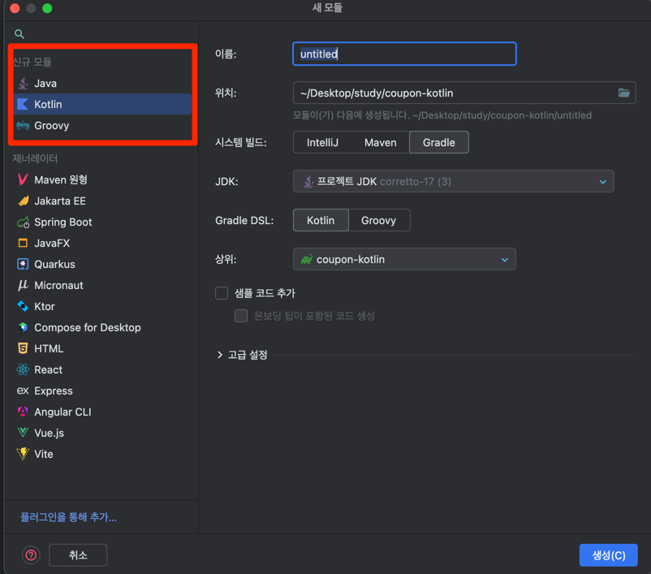

# coupon-v2

---
### ref 멀티모듈 만드는법

### 1. 프로젝트 생성 후 src 폴더 제거

### 2. 모듈 생성 후 자바, 코틀린 파일 


## 3. 최상단 settings.gradle 파일 수정
```
rootProject.name = "최상단 프로젝트명"
include("모듈1", "모듈2", "모듈3")`
```

## 4. 최상위 모듈의 build.gradle 파일 수정
```
val bootJar: org.springframework.boot.gradle.tasks.bundling.BootJar by tasks

bootJar.enabled = false

plugins {
    java
    id("org.springframework.boot") version "3.1.5"
    id("io.spring.dependency-management") version "1.1.3"
}

group = "com.example"
version = "0.0.1-SNAPSHOT"

java {
    sourceCompatibility = JavaVersion.VERSION_17
}

configurations {
    compileOnly {
        extendsFrom(configurations.annotationProcessor.get())
    }
}

repositories {
    mavenCentral()
}


subprojects {
    apply(plugin = "java")
    apply(plugin = "io.spring.dependency-management")
    apply(plugin = "org.springframework.boot")

    repositories {
        mavenCentral()
    }

    dependencies {
        
    }
}

tasks.withType<Test> {
    useJUnitPlatform()
}
```

## 5. 각 모듈의 build.gradle 파일 수정

```
val bootJar: org.springframework.boot.gradle.tasks.bundling.BootJar by tasks

bootJar.enabled = false

repositories {
    mavenCentral()
}

dependencies {
    
}

tasks.withType<Test> {
    useJUnitPlatform()
}
```

--- 
## locust

1. master와 worker 설정
```angular2html
version: '3.7'
services:
master:
image: locustio/locust
ports:
- "8089:8089"
volumes:
- ./:/mnt/locust
command: -f /mnt/locust/locustfile-hello.py --master -H http://host.docker.internal:8082

worker:
image: locustio/locust
volumes:
- ./:/mnt/locust
command: -f /mnt/locust/locustfile-hello.py --worker --master-host master
```

2. worcker 수 증가
```angular2html
docker-compose up --scale worker=3
```


